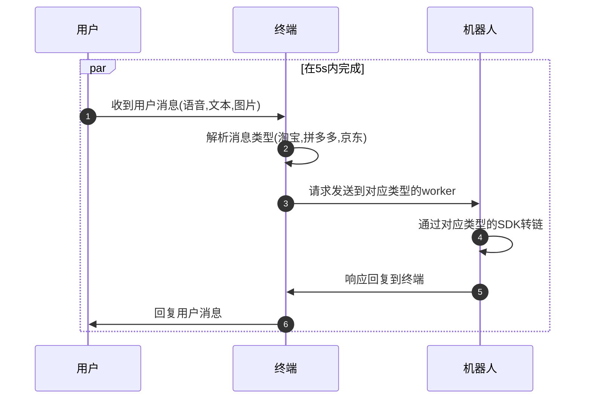

```mermaid
sequenceDiagram
    autonumber
    participant user as 用户
    participant terminal as 终端
    participant worker as 机器人
     par 在5s内完成
    user ->> terminal : 收到用户消息(语音,文本,图片)
    terminal ->> terminal: 解析消息类型(淘宝,拼多多,京东)
    terminal ->> worker:请求发送到对应类型的worker
    worker ->> worker :通过对应类型的SDK转链
    worker ->> terminal : 响应回复到终端
    terminal ->> user : 回复用户消息
    end
```
